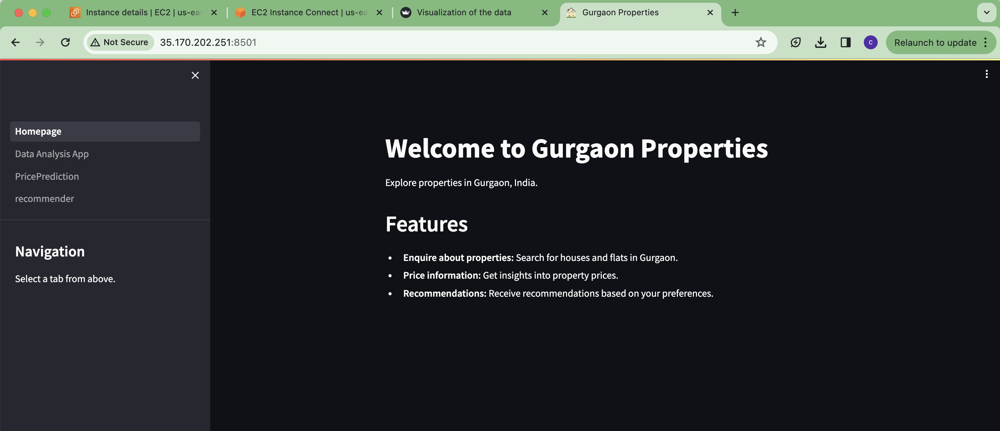

# Real Estate Capstone Project

This project explores the application of data science techniques for real estate use cases. Created a streamlit website having three components of the project: "Property data analysis APP", "Price prediction module" and "Recommender System". Our model is trained on the property data of Gurgaon city in India and our final trained model achieve R-squared score of 90.8 which indicate the model's explainablity for the prediction. 


# Some of the screenshots of web application are below:

**Data Analysis**



**Price Prediction**


**Recommender System**


## Components of the project:
1. Data ingestion, Data Cleaning and  Data Preprocessing.
2. Exploratory data Analysis, Feature Engineering and feature selection using different statistical techniques and using machine learning models.
3. Model building, model selection and hyperparameter finetuning.
4. Building Recommender sysytem.
5. Streamlit webapplication 
6. Model deployement on cloud using AWS EC2 instance.

## 1. Data Ingestion and data Preparation, EDA and feature selection:

- Data was gathered from real estate property websites such as 99acres and others.
- Raw independent-house data file: "/Users/ravina/Desktop/RealEstateProject/Datasets/independent-house - independent-house.csv"
- Raw flats data- "/Users/ravina/Desktop/RealEstateProject/Datasets/flats - flats.csv"
- The collected data underwent meticulous cleaning to address missing values and inconsistencies. Information on houses and flats was merged into a unified file "/Users/ravina/Desktop/RealEstateProject/Datasets/flat-housemerged.csv".
- Techniques like deletion, mean/median imputation were explored to address missing values in the data.
- Feature engineering techniques were employed to enrich the data and create new features that provide a more detailed representation of the properties. Examples include additional room indicators, area with type specifications, and age of possession.
- Feature selection methods like correlation analysis and feature importance analysis were used to identify the most relevant features for price prediction. Techniques like removing highly correlated features and leveraging Random Forest's feature importance were considered.
- Exploratory Data Analysis (EDA) was conducted using techniques pandas, matplotlibn, seaborn and and adavnce technique like Pandas Profiling to understand the data distribution, identify patterns, and uncover relationships between various features.


## Building the Price Prediction Pipeline:

The project outlines the steps involved in creating the model:

1. Model training
2. Model evaluation
3. Model selection (XGBoost in this case) and refinement  

- XGBoost, a gradient boosting regression model, was trained on the prepared data and achieved the best accuracy in predicting property prices. Other regression models have also been explored during the project. XGBoost performed the best.
- The model was evaluated on unseen data using metrics like R-squared. model achieved R-squared score of 0.90876 and Mean Squared Error (MSE) of 0.202. This assessment helps gauge the model's effectiveness in predicting property prices.


# Building Recommender sysytem
Recommender system provides users with the recommended property options according to the user preferences.


# Building streamlit web application:
Streamlit is being used to develop a user-friendly web application. This application will allow users to interact with the model and potentially predict property prices based on user-provided features.

## Website Components

Our project comprises three main components:

1. **Data Preprocessing and Data Analysis**: This component involves preprocessing the data and conducting thorough data analysis to provide insights about the data.
2. **Price Prediction**: In this component, we developed a predictive component to estimate prices based on various features and factors related to the dataset.

3. **Recommendation Module**: The recommendation module is designed to provide recommendations based on user preferences.


## Deployment on AWS:

Amazon Web Services (AWS) is used to deploy the web application. This ensures scalability to accommodate increasing user traffic and maintain accessibility for users from various locations.


[Website Demo Video](https://youtu.be/n9o6-aBAAVo)

[Link of the website:] (http://35.170.202.251:8501/) 


# How to use
1. Clone the repository:
   ```bash
   git clone (https://github.com/ravina029/book-recommendor)

2. run the command 
   streamlit run website/Homepage.py
 


# Deployed Streamlit app on EC2 instance

## 1. Login with your AWS console and launch an EC2 instance

## 2. Run the following commands

### Note: Do the port mapping to this port:- 8501

```bash
sudo apt update
```

```bash
sudo apt-get update
```

```bash
sudo apt upgrade -y
```

```bash
sudo apt install git curl unzip tar make sudo vim wget -y
```

```bash
git clone https://github.com/ravina029/RealEstateProject.git
```

```bash
sudo apt install python3-pip
```

```bash
pip3 install -r requirements.txt
```

```bash
#Temporary running
python3 -m streamlit run website/Homepage.py
```

```bash
#Permanent running
nohup python3 -m streamlit run website/Homepage.py
```

Note: Streamlit runs on this port: 8501


Overall, this project showcases the power of data science in real estate. By leveraging data collection, cleaning, feature engineering, model building with XGBoost achieving the best accuracy, and deployment on a cloud platform, the project aims to create a valuable tool for users to gain insights into the Gurgaon real estate market,predicting price and getting recommendation about the properties.

